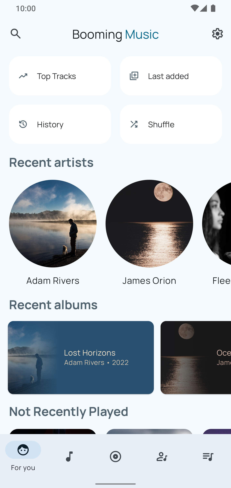
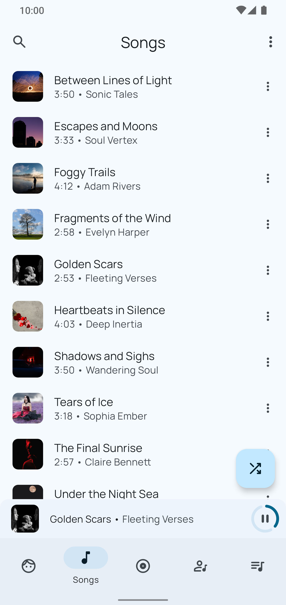
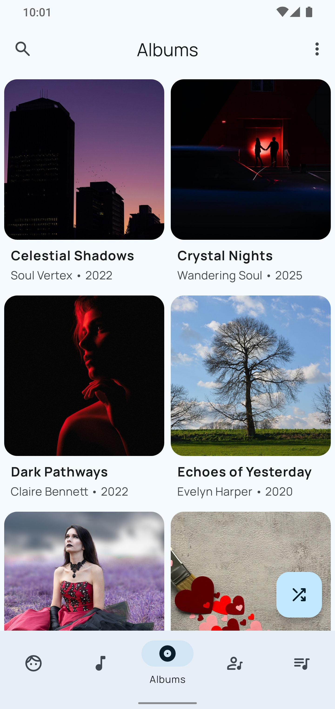
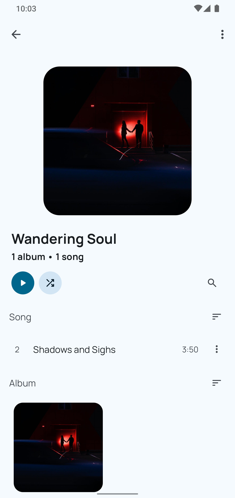
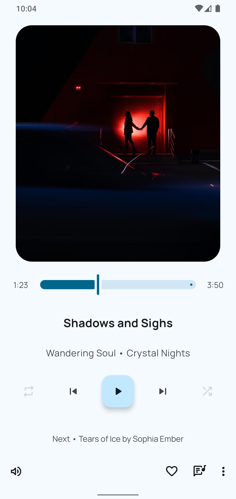
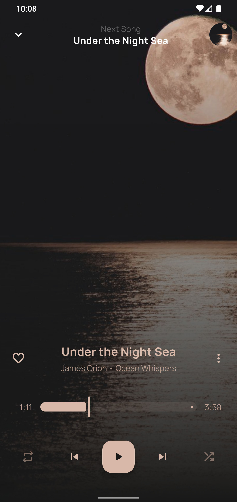
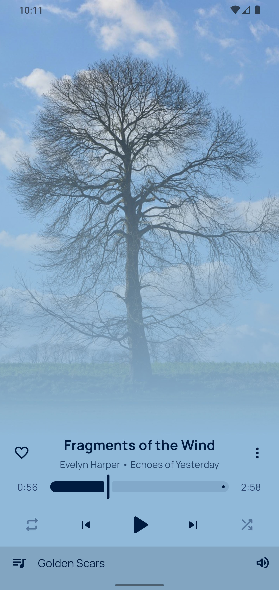
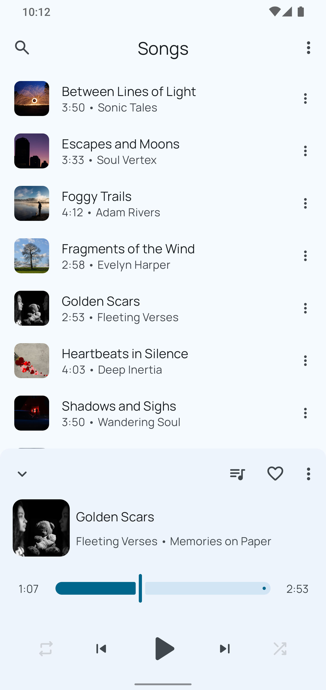

# Geet Music

### A modern, Material 3 local music player built for smooth offline listening

_This is a fork of [BoomingMusic](https://github.com/mardous/BoomingMusic) by [Christians Martínez Alvarado](https://github.com/mardous)_

## 🎶 Key Features

- **Automatic Lyrics Download & Editing**: Automatically download and sync lyrics with your music, and edit them to your preference.
- **Gapless Playback**: Enjoy uninterrupted transitions between tracks for a seamless listening experience.
- **Built-in Equalizer**: Fine-tune your audio with a built-in equalizer, and customize or share your settings.
- **Smart Playlists**: Automatically create playlists like Recently Played, Most Played, and History.
- **Bluetooth & Headset Support**: Control your music seamlessly via Bluetooth or wired headsets.
- **Android Auto Support**: Fully integrated with Android Auto for hands-free listening on the go.
- **Material You Design**: Support for Android's Material You design system, offering dynamic theming and a modern look.
- **Folder-based Browsing**: Play your music from any folder on your device.
- **Sleep Timer**: Set a sleep timer to automatically stop playback after a set time.
- **Widgets**: Add home screen and lock screen widgets for quick access and control.

## ⚙️ Additional Features

- Monet-themed icons (Android 13+)
- Browse and organize music by songs, albums, artists, playlists, genres, and year
- Tag editor for editing song metadata
- Smart auto playlists (Recently Played, Most Played, History)
- ReplayGain support
- Automatic download of artist images
- Blacklist and whitelist support

## 📱 Screenshots

## ✅ Planned

- [ ] 📦 Custom music library scanner (fully independent from MediaStore)
- [ ] 🎨 Multiple artist support (splitting and indexing songs with multiple artists)
- [ ] 🎵 Improved genre handling (same logic as multiple artists)
- [ ] 💬 Word-by-word synced lyrics (enhanced lyric display)
- [ ] 🔁 Last.fm integration (import most played songs, possibly export support too)
- [ ] 💿 Artist page improvements (differentiate albums and singles visually)
- [ ] 📺 Experimental Android TV support (maybe... if there's enough interest!)

## 💿 Supported formats

Geet Music relies on native [MediaPlayer API](https://developer.android.com/guide/topics/media/mediaplayer) for audio files reproduction.
You can visit [this page](https://developer.android.com/guide/topics/media/media-formats) for detailed
information about MediaPlayer API file and format support.

## 🔒 Requested permissions

Our app requires only the necessary permissions for its operation, therefore, you can read [this document](PERMISSIONS.md)
to obtain more details about each permission and why it is required.

## 🤝 Contributing

Geet Music is an open-source project, and contributions are always welcome!
See the [Contributing](CONTRIBUTING.md) document. It will be a good starting point if you are interested
in contributing to this project, thank you very much in advance.

If you enjoy using Geet Music or like where it's heading, consider leaving a ⭐ on the
repository — it helps the project grow and motivates continued development.

Feel free to open issues, submit pull requests, or just share your ideas. Every bit of feedback
is appreciated!

## 👏 Credits

Geet Music is a fork of [BoomingMusic](https://github.com/mardous/BoomingMusic) by [Christians Martínez Alvarado](https://github.com/mardous).

BoomingMusic itself is built upon the open-source project [Retro Music](https://github.com/RetroMusicPlayer/RetroMusicPlayer),
which served as a starting point for many features and functionality.

It is also important to mention:

- [LRCLib](https://lrclib.net/)
- [spotify-lyrics-api](https://github.com/akashrchandran/spotify-lyrics-api) by [Akash R Chandran](https://github.com/akashrchandran)
- [Alex](https://github.com/Paxsenix0)
- [Nothing Font 5x7](https://fontstruct.com/fontstructions/show/1766618/nothing-font-5x7) from FontStruct

## ⚖️ License

Geet Music is released under the GNU General Public License, which can be found [here](LICENSE.txt).
